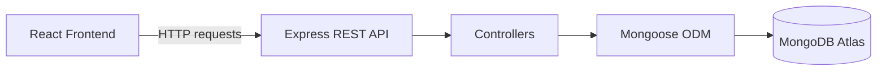

# Ecommerce Backend API (React e-commerce)

This project is the **backend REST API for a React e-commerce application**, built with Node.js, Express, MongoDB, and Mongoose. The database is hosted using **MongoDB Atlas**.

## Tech Stack

- **Runtime:** Node.js (ES6 Modules)
- **Framework:** Express.js
- **Database:** MongoDB Atlas (Mongoose ODM)
- **Tools:** ESLint, Nodemon, CORS, dotenv

## Quick Start

```bash
# Install dependencies
npm install

# Setup environment
cp .env.example .env
# Add your MongoDB Atlas URI to .env

# Run development server
npm run dev

# Seed sample data
npm run seed:products
npm run seed:delivery-options
npm run seed:cart-items
```

## API Base URL

```
http://localhost:6000/api
```

## API Endpoints

| Method   | Endpoint                | Description                                   |
| -------- | ----------------------- | --------------------------------------------- |
| GET      | `/api/products`         | Get all products (supports `?search=keyword`) |
| GET/POST | `/api/cart-items`       | Manage shopping cart                          |
| GET/POST | `/api/orders`           | Create and manage orders                      |
| GET/POST | `/api/delivery-options` | Manage delivery methods                       |
| GET      | `/api/payment-summary`  | Get order payment details                     |
| POST     | `/api/reset`            | Reset all data to seed state                  |

## Example Request WITH RESPONSE

**Request:**

```
GET /api/products?search=shirt
```

**Response:**

```json
[
  {
    "id": "83d4ca15-0f35-48f5-b7a3-1ea210004f2e",
    "image": "images/products/adults-plain-cotton-tshirt-2-pack-teal.jpg",
    "name": "Adults Plain Cotton T-Shirt - 2 Pack",
    "rating": { "stars": 4.5, "count": 56 },
    "priceCents": 1890,
    "keywords": ["shirt", "apparel"]
  }
]
```

## Project Structure

```
├── config/          MongoDB connection
├── controllers/     Business logic
├── middleware/      Request logging & error handling
├── models/          Mongoose schemas
├── routes/          API endpoints
├── scripts/         Database seeders
└── server.js        Entry point
```

## Environment Variables

```
NODE_ENV=development
DATABASE_URI=your_mongodb_connection_string
PORT=6000
```

## Available Scripts

```bash
npm start                    # Production server
npm run dev                  # Development with auto-reload
npm run lint                 # Run ESLint
npm run seed:products        # Seed products
npm run seed:delivery-options
npm run seed:cart-items
```

## Related Project

Frontend application:  
https://github.com/Srinivas-KR-Dev/react-ecommerce-typescript

## Architecture Diagram



## License

MIT - See [LICENSE](LICENSE) file
