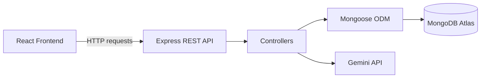

# Ecommerce Backend API (React e-commerce)

This project is the **backend REST API for a React e-commerce application**, built with Node.js, Express, MongoDB, and Mongoose. The database is hosted using **MongoDB Atlas**.

It also serves the built frontend from `dist/` on the same domain and supports frontend route refreshes such as `/orders` and `/checkout`.

Built a lightweight **RAG-style shopping assistant** using Gemini, MongoDB product data, and backend-side product retrieval before AI response generation.

## Project Overview

The API provides backend services for:

- product catalog search
- AI product search using Gemini
- AI shopping assistant recommendations
- shopping cart management
- checkout and payment summary calculation
- order creation and order history

## Tech Stack

- **Runtime:** Node.js (ES Modules)
- **Framework:** Express.js 5
- **Database:** MongoDB Atlas
- **ODM:** Mongoose
- **AI:** Google Gemini API
- **Tools:** ESLint, Nodemon, CORS, dotenv

## Quick Start

```bash
# Install dependencies
npm install

# Setup environment
# Create .env from .env.example
# Add your MongoDB Atlas connection string and Gemini API key

# Seed sample data
npm run seed:products
npm run seed:delivery-options
npm run seed:cart-items

# Run development server
npm run dev
```

## API Base URL

```text
http://localhost:7000/api
```

Frontend root:

```text
http://localhost:7000/
```

## API Endpoints

| Method       | Endpoint                     | Description                                   |
| ------------ | ---------------------------- | --------------------------------------------- |
| `GET`        | `/api/products`              | Get all products (supports `?search=keyword`) |
| `GET`        | `/api/ai-search`             | AI-powered product search using `?query=`     |
| `POST`       | `/api/ai-assistant`          | AI shopping assistant reply with products     |
| `GET`        | `/api/delivery-options`      | Get available delivery methods                |
| `GET/POST`   | `/api/cart-items`            | Get cart items or add an item                 |
| `PUT/DELETE` | `/api/cart-items/:productId` | Update or remove a cart item                  |
| `GET/POST`   | `/api/orders`                | Create and manage orders                      |
| `GET`        | `/api/orders/:orderId`       | Get a single order                            |
| `GET`        | `/api/payment-summary`       | Get order payment details                     |
| `POST`       | `/api/reset`                 | Reset all data to seed state in development   |

## Frontend Route Handling

The backend serves `dist/index.html` for non-API `GET` frontend routes when a built frontend exists.

Examples:

- `/`
- `/orders`
- `/checkout`
- `/index`
- `/index.html`

If `dist/index.html` does not exist, the route returns a `404`.

## Example Request With Response

**Request:**

```http
GET /api/products?search=shirt
```

**Response:**

```json
[
  {
    "id": "83d4ca15-0f35-48f5-b7a3-1ea210004f2e",
    "image": "images/products/adults-plain-cotton-tshirt-2-pack-teal.jpg",
    "name": "Adults Plain Cotton T-Shirt - 2 Pack",
    "rating": {
      "stars": 4.5,
      "count": 56
    },
    "priceCents": 59900,
    "keywords": [
      "tshirts",
      "mens",
      "cotton tshirt",
      "casual wear",
      "everyday wear",
      "pack of 2",
      "basic tshirt"
    ]
  }
]
```

## Project Structure

```text
├── config/          MongoDB and Mongoose connection setup
├── controllers/     Business logic and AI controllers
├── middleware/      Request logging and error handling
├── models/          Mongoose schemas
├── routes/          API endpoints and frontend root route
├── scripts/         Seed scripts
├── data/            Seed data
└── server.js        Entry point
```

## Environment Variables

```env
NODE_ENV=development
DATABASE_URI=your_mongodb_atlas_connection_string
GEMINI_API_KEY=your_gemini_api_key_here
PORT=7000
```

## Available Scripts

```bash
npm start                      # Production server
npm run dev                    # Development with auto-reload
npm run lint                   # Run ESLint
npm run seed:products          # Seed products
npm run seed:delivery-options  # Seed delivery options
npm run seed:cart-items        # Seed cart items
npm run zip                    # Create backup zip
```

## Static Files And 404 Handling

- Static files are served from `public/`
- Static files are also served from `dist/`
- Non-API frontend `GET` routes return `dist/index.html` when available
- Unknown API routes return JSON: `{ "error": "404 not found" }`

## Related Project

Frontend application:
https://github.com/Srinivas-KR-Dev/react-ecommerce-typescript

## Architecture Diagram



## License

MIT - See [LICENSE](LICENSE) file
